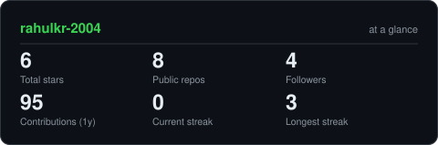
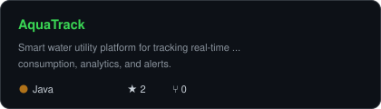
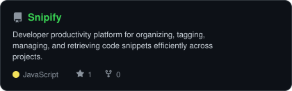

<div align="center">

<!-- PORTRAIT - dot-matrix SVG portrait -->


<br>

<!-- NAME / TAGLINE - animated typing -->
<a href="https://github.com/rahulkr-2004">
  
</a>

<br>

<!-- SOCIALS -->
<a href="https://www.linkedin.com/in/rahulkr2004/"></a>
<a href="mailto:rahulamp2003@gmail.com"></a>
<a href="https://rahulkr-2004.netlify.app/"></a>
<a href="https://codolio.com/profile/C6HHryCX"></a>
<a href="https://leetcode.com/u/rahulkr_2004/"></a>


</div>

---

## `~/` whoami

```console
$ cat about.txt
```

Hi, I'm **Rahul Kumar**. I build things that sit at the intersection of **cyber security** and **Java backend architecture**,
and I solve problems for fun when neither of those is cooperating.

- Currently building **[AquaTrack](https://github.com/rahulkr-2004/AquaTrack---Water-Management-System)** and **[Snipify](https://github.com/rahulkr-2004/Snipify)**
- Portfolio: **[rahulkr-2004.netlify.app](https://rahulkr-2004.netlify.app/)**
- Codolio: **[Rahul Kumar @ Codolio](https://codolio.com/profile/C6HHryCX)**
- LeetCode: **[rahulkr_2004](https://leetcode.com/u/rahulkr_2004/)**
- Learning **Advanced Penetration Testing + Spring Cloud Microservices**
- Fun fact: **"Security isn't an afterthought; it's the foundation."**

<br>

<div align="center">

## `~/` toolbox


</div>

---

<div align="center">

## `~/` skill radar

<table>
<tr>
<td width="50%" align="center" valign="middle">

<!-- Self-rated radar - edit assets/skills.json, the workflow redraws it -->
<picture>
  <source media="(prefers-color-scheme: dark)"  srcset="assets/radar-dark.svg">
  <source media="(prefers-color-scheme: light)" srcset="assets/radar-light.svg">
  
</picture>

</td>
<td width="50%" align="center" valign="middle">

<!-- Live radar built from real language byte counts across your repos -->
<picture>
  <source media="(prefers-color-scheme: dark)"  srcset="assets/radar-langs-dark.svg">
  <source media="(prefers-color-scheme: light)" srcset="assets/radar-langs-light.svg">
  
</picture>

</td>
</tr>
</table>

</div>

---

<div align="center">

## `~/` contribution calendar

<!-- 3D isometric calendar, regenerated every 6h by .github/workflows/metrics.yml -->


<br><br>

<!-- Snake eats the contribution graph - .github/workflows/snake.yml -->
<picture>
  <source media="(prefers-color-scheme: dark)"  srcset="https://raw.githubusercontent.com/rahulkr-2004/rahulkr-2004/output/snake-dark.svg">
  <source media="(prefers-color-scheme: light)" srcset="https://raw.githubusercontent.com/rahulkr-2004/rahulkr-2004/output/snake.svg">
  
</picture>

</div>

---

<div align="center">

## `~/` the numbers

<!-- Generated by scripts/cards.py into this repo -->
<picture>
  <source media="(prefers-color-scheme: dark)"  srcset="assets/card-stats-dark.svg">
  <source media="(prefers-color-scheme: light)" srcset="assets/card-stats-light.svg">
  
</picture>

<br>


<br><br>

<!-- REALTIME CODOLIO & LEETCODE STATS CARD -->
<a href="https://codolio.com/profile/C6HHryCX">
  
</a>

</div>

---

<div align="center">

## `~/` selected work

<!-- Cards generated by scripts/cards.py from assets/projects.json -->
<table>
<tr>
<td width="50%">
  <a href="https://github.com/rahulkr-2004/AquaTrack---Water-Management-System">
    <picture>
      <source media="(prefers-color-scheme: dark)"  srcset="assets/card-AquaTrack---Water-Management-System-dark.svg">
      <source media="(prefers-color-scheme: light)" srcset="assets/card-AquaTrack---Water-Management-System-light.svg">
      
    </picture>
  </a>
</td>
<td width="50%">
  <a href="https://github.com/rahulkr-2004/Snipify">
    <picture>
      <source media="(prefers-color-scheme: dark)"  srcset="assets/card-Snipify-dark.svg">
      <source media="(prefers-color-scheme: light)" srcset="assets/card-Snipify-light.svg">
      
    </picture>
  </a>
</td>
</tr>
</table>

<sub>

| project | live | stack |
|---|---|---|
| **[AquaTrack](https://github.com/rahulkr-2004/AquaTrack---Water-Management-System)** | [smart-aquatrack.vercel.app](https://smart-aquatrack.vercel.app) | `Java` `Spring Boot` `React` |
| **[Snipify](https://github.com/rahulkr-2004/Snipify)** | [snipifyurcode.netlify.app](https://snipifyurcode.netlify.app/) | `JavaScript` `HTML` `CSS` |

</sub>

</div>

---

<div align="center">

<sub>`01110100 01101000 01100001 01101110 01101011 01110011 00100000 01100110 01101111 01110010 00100000 01110011 01100011 01110010 01101111 01101100 01101100 01101001 01101110 01100111`</sub>

</div>
